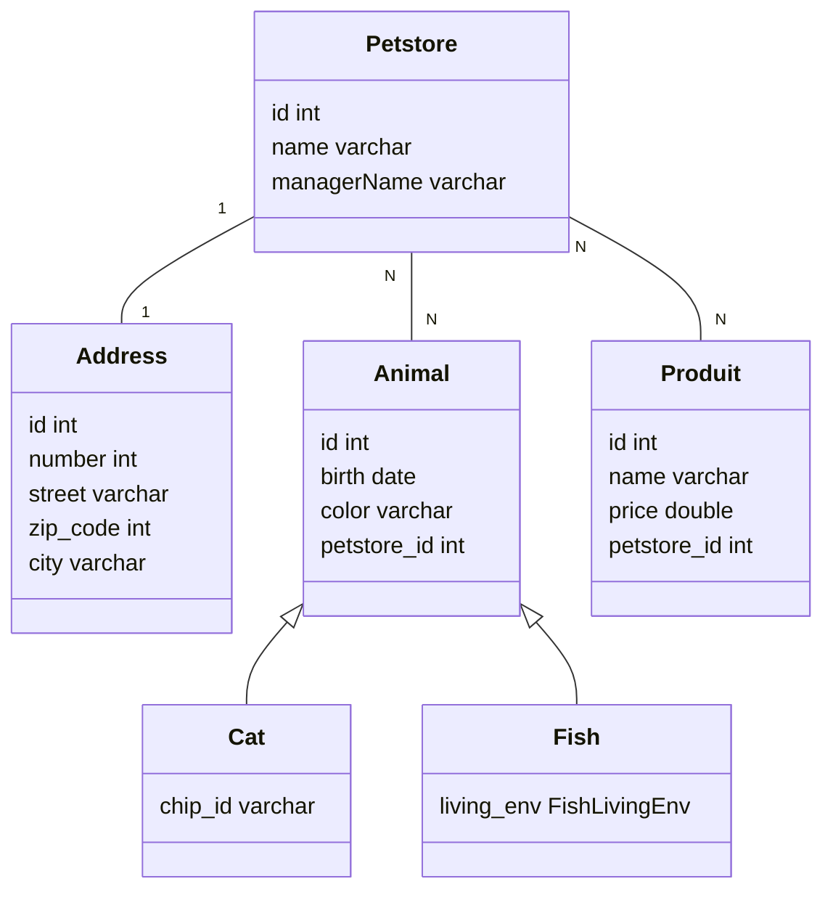

# tp-springboot

Projet de Quentin VERDER TP SpringBoot pour le rendu final de cours de Java.

## Installation

Pour installer le projet, il suffit de cloner le projet sur votre machine.

```bash
git clone
```

Installer les dépendances Maven.

```bash
mvn install
```

## Configuration

Pour configurer la connection avec les bases de données, il suffit de modifier le fichier `application.properties` dans le dossier `src/main/resources`.

```properties
spring.datasource.url=jdbc:mysql://localhost:3306/<databaseName>
spring.datasource.username=<databaseUser>
spring.datasource.password=<databasePassword>
```

## Utilisation

Pour lancer le projet, il suffit de lancer la commande suivante.

```bash
mvn spring-boot:run
```

## Schema de base de données


